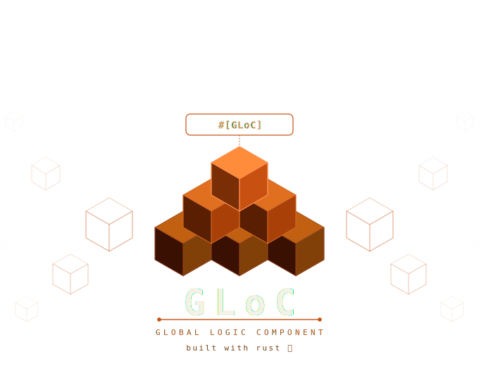

<div align="center">

# GLoC

_The **G** is intentional. GLoc started as a hobby project called **G**odwin's **B**usiness **L**ogic **C**omponent,
born from a mission to bring Flutter's legendary **BLoC** architecture into Rust.
But as it grows to serve the wider open-source community, that **G** now stands for **Global**.
One pattern. Universal. Everywhere Rust runs._

A universal business logic architecture for Rust.

[](https://github.com/godwinjk/gloc/actions/workflows/pr.yml)
[](https://github.com/godwinjk/gloc/actions/workflows/main.yml)
[](https://crates.io/crates/gloc)
[](https://docs.rs/gloc)
[](#license)

</div>

---

## What is GLoC?

GLoC is inspired by Flutter's [Bloc](https://bloclibrary.dev) architecture — but it's its own thing.
It separates **business logic** from **presentation** in any Rust application and works
anywhere Rust runs: web frontends, desktop GUIs, backend servers, CLIs, and embedded targets.

The core abstraction is **`Reactor`** — a single unit that owns one slice of domain state
and exposes domain methods that transition it. Unlike Flutter Bloc which has separate
`Cubit` and `Bloc` types, GLoC has one: a `Reactor` supports both direct method calls
and event dispatch.

```
┌─────────────────────────────────────────────────────────────┐
│  Without GLoC           │  With GLoC                        │
│─────────────────────────│───────────────────────────────────│
│  Logic tangled in UI    │  Reactor owns logic               │
│  State scattered        │  Single source of truth           │
│  Hard to test           │  Fully injectable & mockable      │
│  Framework-locked       │  Web · Desktop · CLI · Embedded   │
└─────────────────────────────────────────────────────────────┘
```

**One pattern. Everywhere Rust runs.**

---

## Table of Contents

- [Concepts](#concepts)
- [Installation](#installation)
- [Quick Start](#quick-start)
- [Define State](#define-state)
- [Define a Reactor](#define-a-reactor)
- [Observers](#observers)
- [Reactive Layer](#reactive-layer)
- [Dioxus Example](#dioxus-example)
- [Feature Flags](#feature-flags)
- [Roadmap](#roadmap)
- [Contributing](#contributing)
- [License](#license)

---

## Concepts

### ⚛️ Reactor

A **Reactor** is the central unit of business logic in GLoC — the equivalent of a BLoC in Flutter or a ViewModel in other architectures. It owns the current **State**, exposes methods to mutate it, and emits a new state to all subscribers whenever something changes.

You define a reactor as a plain Rust struct annotated with `#[reactor]`. GLoC generates the reactive plumbing — subscription, change detection, and provider wiring — so you only write the logic that matters.

```rust
#[reactor(state = CounterState)]
pub struct CounterReactor {}

impl CounterReactor {
    pub fn increment(&mut self) {
        self.emit(CounterState { count: self.count + 1 });
    }
}
```

A reactor that also accepts **Neutrons** receives them through a generated `fire()` method and routes them to your `on_event` handler, keeping dispatch decoupled from the call site.

---

### ☢️ Neutron (Event)

A **Neutron** is an immutable event fired *at* a reactor — the signal that triggers a state transition. The name follows GLoC's nuclear fission theme: a neutron strikes the reactor core and causes a reaction.

Neutrons can be **enums, structs, or any type** that satisfies `Debug + Send + 'static` — no base trait to extend or import. Enums are the most common choice when a reactor handles multiple distinct events:

```rust
#[derive(Debug)]
pub enum CounterNeutron {
    Increment,
    Decrement,
    Reset,
}

impl CounterReactor {
    fn on_event(&mut self, neutron: CounterNeutron) {
        match neutron {
            CounterNeutron::Increment => self.emit(CounterState { count: self.count + 1 }),
            CounterNeutron::Decrement => self.emit(CounterState { count: self.count - 1 }),
            CounterNeutron::Reset     => self.emit(CounterState { count: 0 }),
        }
    }
}

// At the call site:
reactor.fire(CounterNeutron::Increment);
```

Neutrons are consumed on dispatch — not cloned or stored. `Event` is kept as a type alias for backward compatibility, but **Neutron is the preferred term**.

---

### 🔋 State

**State** is a snapshot of everything a reactor knows at a given moment — pure data, no behaviour. Any type that implements `Clone + PartialEq + Debug` is automatically a `State`. Use `#[reactor_state]` to skip writing the derives:

```rust
#[reactor_state]
pub struct CounterState {
    pub count: i32,
}
```

GLoC performs **change detection**: calling `emit()` with a value equal to the current state is a no-op — no notification is sent and no re-render is triggered. Only genuine transitions propagate.

State is always read through the reactor — directly via `Deref` (`reactor.count`) or through a subscription stream. Subscribers always receive the latest value and are notified on every real transition.

---

### Other primitives

| Concept | Description |
|---------|-------------|
| **`emit()`** | State-transition primitive inside a reactor. Built-in change detection — emitting the same value is a no-op. |
| **`GlocStream`** | Reactive state container — notifies listeners on every real transition. |
| **`GlocProvider`** | Shared `Arc<Mutex<R>>` handle for reading and mutating a reactor across threads or components. |
| **`GlocListener`** | Trait for typed `old → new` transition observers. |
| **`GlocObserver`** | Global observer that receives every transition across all reactors. |

---

## Installation

Add a single dependency — `gloc` includes both the core traits and the `#[reactor]` macro:

```toml
[dependencies]
gloc = "0.2"
```

Then import everything from one place:

```rust
use gloc::{reactor, Reactor, State, ReactorBase};
```

**Advanced** — use the individual crates if you only need part of the library:

```toml
[dependencies]
gloc-core  = "0.2"   # traits only — Reactor, State, ReactorBase
gloc-macro = "0.2"   # #[reactor] macro only
```

**With tracing** — logs every state transition via the [`tracing`](https://crates.io/crates/tracing) crate:

```toml
[dependencies]
gloc    = { version = "0.2", features = ["tracing"] }
tracing = "0.1"
```

---

## Quick Start

### Simple — just a reactor

The common case. Create a reactor, call methods, listen to transitions.

```rust
use gloc::{reactor, reactor_state, Reactor};

// 1. State — derives injected automatically by the macro
#[reactor_state]
pub struct CounterState { pub count: i32 }

// 2. Reactor — one line, macro generates impl Reactor, new(), on_change(), subscribe()
#[reactor(state = CounterState)]
pub struct CounterReactor {}

// 3. Domain logic only — no boilerplate
impl CounterReactor {
    pub fn increment(&mut self) {
        self.emit(CounterState { count: self.state().count + 1 });
    }
}

fn main() {
    let mut counter = CounterReactor::new(CounterState { count: 0 });

    // Listen to every real state transition (old → new)
    counter.on_change(|old, new| println!("{} → {}", old.count, new.count));

    counter.increment(); // prints: 0 → 1
    counter.increment(); // prints: 1 → 2

    assert_eq!(counter.state().count, 2);
}
```

### Shared — same reactor across multiple consumers

When you need to share one reactor between components or threads, wrap it in
a `GlocConsumer`. All clones of the consumer share the same reactor — a mutation
from any one is visible to all.

```rust
use gloc::{reactor, reactor_state, Reactor, GlocConsumer, GlocStream};
use std::sync::{Arc, Mutex};

#[reactor_state]
pub struct CounterState { pub count: i32 }

#[reactor(state = CounterState)]
pub struct CounterReactor {}

impl CounterReactor {
    pub fn increment(&mut self) {
        self.emit(CounterState { count: self.state().count + 1 });
    }
}

fn main() {
    let initial  = CounterState { count: 0 };
    // Arc<Mutex<R>> — shared ownership, safe to mutate across threads
    let reactor  = Arc::new(Mutex::new(CounterReactor::new(initial.clone())));
    // GlocStream — reactive channel that carries state transitions to listeners
    let stream   = GlocStream::new(initial);
    // GlocConsumer — cheap clone handle; all clones share the same reactor + stream
    let consumer = GlocConsumer::new(reactor, stream);

    let c1 = consumer.clone();
    let c2 = consumer.clone();

    c1.listen(|old, new| println!("{} → {}", old.count, new.count));

    c2.update(|r| r.increment()); // c1's listener fires: 0 → 1
    c2.update(|r| r.increment()); // c1's listener fires: 1 → 2

    assert_eq!(c1.state().count, 2);
    assert_eq!(c2.state().count, 2); // both see the same state
}
```

> **When do you need `GlocConsumer`?** When you have multiple components or threads
> that all need to read and mutate the same reactor — like a UI framework with
> separate widgets sharing one piece of state. For single-owner use, just use the
> reactor directly.

---

## Define State

Any `Clone + PartialEq + Debug` type is automatically a `State` — no explicit impl needed.
Use `#[reactor_state]` to skip writing the derives:

```rust
use gloc::reactor_state;

// Struct state
#[reactor_state]
pub struct CounterState { pub count: i32 }

// Enum state — great for loading flows
#[reactor_state]
pub enum FetchState { Idle, Loading, Success(String), Error(String) }

// With extra derives
#[reactor_state(derive(Hash, Eq))]
pub struct TagState { pub tag: u32 }
```

---

## Define a Reactor

### Mode A — bring your own state

```rust
use gloc::{reactor, reactor_state, Reactor};

#[reactor_state]
pub struct CounterState { pub count: i32 }

#[reactor(state = CounterState)]
pub struct CounterReactor {}

impl CounterReactor {
    pub fn increment(&mut self) {
        self.emit(CounterState { count: self.state().count + 1 });
    }
    pub fn decrement(&mut self) {
        self.emit(CounterState { count: self.state().count - 1 });
    }
    pub fn reset(&mut self) {
        self.emit(CounterState { count: 0 });
    }
}

let mut r = CounterReactor::new(CounterState { count: 0 });
r.increment();
r.increment();
assert_eq!(r.state().count, 2);
```

### Mode B — let GLoC generate the state struct

Annotate fields with `#[state]` — the macro generates `{ReactorName}State` automatically:

```rust
use gloc::{reactor, Reactor};

#[reactor]
pub struct ToggleReactor {
    #[state] pub active: bool,
}

// Macro generates: pub struct ToggleReactorState { pub active: bool }

impl ToggleReactor {
    pub fn toggle(&mut self) {
        self.emit(ToggleReactorState { active: !self.state().active });
    }
}

let mut toggle = ToggleReactor::new(ToggleReactorState { active: false });
toggle.toggle();
assert!(toggle.state().active);
```

### What the macro generates

Every `#[reactor]` struct gets:

| Generated | Description |
|---|---|
| `impl Reactor` | `state()`, `emit()` with change-detection |
| `new(initial)` | Constructor — suppress with `no_new` |
| `on_change(old, new)` | Observer registration — suppress with `no_observers` |
| `subscribe()` | Returns a `GlocSubscription` read-only handle |
| `attach_listener(l)` | Attaches a `GlocListener` impl |

### Attribute options

| Argument | Effect |
|---|---|
| `state = SomeType` | Mode A — use an existing type |
| `no_new` | Skip `new()` generation |
| `no_observers` | Skip `on_change()` and stream field |

---

## Observers

`on_change` receives **both** old and new state on every real transition:

```rust
let mut r = CounterReactor::new(CounterState { count: 0 });

r.on_change(|old, new| {
    println!("{} → {}", old.count, new.count);
});

r.increment(); // prints: 0 → 1
r.increment(); // prints: 1 → 2
r.emit(CounterState { count: 2 }); // no-op — no print
```

For typed observers implement `GlocListener`:

```rust
use gloc::GlocListener;

struct Logger;

impl GlocListener<CounterReactor> for Logger {
    fn on_transition(&self, old: &CounterState, new: &CounterState) {
        println!("{} → {}", old.count, new.count);
    }
}

r.attach_listener(Logger);
```

---

## Reactive Layer

Share a reactor across components or threads using `GlocConsumer`:

```rust
use gloc::{reactor, reactor_state, Reactor, GlocConsumer, GlocStream};
use std::sync::{Arc, Mutex};

#[reactor_state]
pub struct CounterState { pub count: i32 }

#[reactor(state = CounterState)]
pub struct CounterReactor {}

impl CounterReactor {
    pub fn increment(&mut self) {
        self.emit(CounterState { count: self.state().count + 1 });
    }
}

// Shared reactor + stream
let reactor  = Arc::new(Mutex::new(CounterReactor::new(CounterState { count: 0 })));
let stream   = GlocStream::new(CounterState { count: 0 });
let consumer = GlocConsumer::new(reactor, stream);

// Multiple consumers share the same reactor
let c1 = consumer.clone();
let c2 = consumer.clone();

// Listen from any consumer
c1.listen(|old, new| println!("{} → {}", old.count, new.count));

// Mutate through any consumer — all listeners are notified
c2.update(|r| r.increment()); // c1's listener prints: 0 → 1

assert_eq!(c1.state().count, 1);
assert_eq!(c2.state().count, 1);
```

> Framework adapters (Dioxus, Axum, Bevy) will provide a `GlocProvider` that
> wraps this wiring for you. See the `gloc-dioxus` crate (planned for v0.4).

---

## Dioxus Example

GLoC reactors integrate cleanly with any Rust UI framework. Here is the full counter
example using [Dioxus](https://dioxuslabs.com) 0.7 desktop.

The reactor is stored in a Dioxus `Signal` — reads register the component as a
subscriber, writes trigger re-renders.

```rust
// src/reactors/counter.rs — zero Dioxus imports, pure domain logic
use gloc::Reactor;
use gloc::reactor;

#[derive(Clone, PartialEq, Debug)]
pub struct CounterState {
    pub count: i32,
    pub label: String,
}

impl CounterState {
    pub fn new(count: i32) -> Self {
        let label = match count {
            i32::MIN..=-1 => "Negative",
            0             => "Zero",
            1..=9         => "Low",
            10..=99       => "Medium",
            _             => "High",
        }.into();
        Self { count, label }
    }
}

#[reactor(state = CounterState)]
pub struct CounterReactor {}

impl CounterReactor {
    pub fn increment(&mut self) {
        self.emit(CounterState::new(self.state().count + 1));
    }
    pub fn decrement(&mut self) {
        self.emit(CounterState::new(self.state().count - 1));
    }
    pub fn reset(&mut self) {
        self.emit(CounterState::new(0));
    }
}
```

```rust
// src/main.rs — Dioxus wiring
#![allow(non_snake_case)]
mod reactors;

use reactors::{CounterReactor, CounterState};
use dioxus::prelude::*;
use gloc::Reactor;

fn main() { dioxus::launch(App); }

#[component]
fn App() -> Element {
    let reactor = use_signal(|| CounterReactor::new(CounterState::new(0)));
    rsx! { CounterView { reactor } }
}

#[component]
fn CounterView(reactor: Signal<CounterReactor>) -> Element {
    let state = reactor.read().state().clone();
    rsx! {
        div {
            p { "{state.label}: {state.count}" }
            button { onclick: move |_| reactor.write().decrement(), "−" }
            button { onclick: move |_| reactor.write().reset(),     "Reset" }
            button { onclick: move |_| reactor.write().increment(), "+" }
        }
    }
}
```

Run it:

```sh
cargo run -p gloc-example-dioxus
```

Full example source: [`examples/dioxus/`](examples/dioxus/)

---

## Feature Flags

| Crate | Feature | Effect |
|---|---|---|
| `gloc` | `tracing` | Enables `tracing::debug!` inside `emit()` — logs every state transition. Zero cost when disabled. |
| `gloc-macro` | `tracing` | Same — gates the tracing call in macro-generated `emit()`. |

Enable tracing:

```toml
[dependencies]
gloc               = { version = "0.2", features = ["tracing"] }
tracing            = "0.1"
tracing-subscriber = "0.3"
```

Every `emit()` call that transitions state will log:

```
DEBUG CounterReactor{old=CounterState { count: 0 }, new=CounterState { count: 1 }}
```

---

## Roadmap

| Phase | Version | Status | Description |
|---|---|---|---|
| 1 | v0.1 | ✅ Released | `Reactor` trait, `ReactorBase`, `State` blanket impl |
| 2 | v0.2 | ✅ Latest | `#[reactor]` proc macro — Mode A, Mode B, `on_change`, reactive layer |
| 3 | v0.3 | 🔲 Planned | Event dispatch — `reactor.dispatch(Event)` opt-in pattern |
| 4 | v0.4 | 🔲 Planned | Framework adapters — `gloc-dioxus`, `gloc-axum`, `gloc-bevy` with `GlocProvider` |
| 5 | v1.0 | 🔲 Planned | Stable API, dedicated docs site, DevTools |

---

## Project Structure

```
GLoC/
├── gloc-core/                  Core crate — published as `gloc-core`
│   └── src/
│       ├── lib.rs
│       ├── state.rs            State trait (blanket impl)
│       ├── reactor.rs          Reactor trait + ReactorBase
│       ├── stream.rs           GlocStream + GlocSubscription
│       ├── consumer.rs         GlocConsumer
│       ├── listener.rs         GlocListener trait
│       └── observer.rs         GlocObserver (global)
│   └── tests/
│       ├── reactor_tests.rs    39 integration tests
│       ├── reactive_tests.rs   22 reactive layer tests
│       └── observer_tests.rs   13 observer tests
│
├── gloc-macro/                 Proc macro crate — published as `gloc-macro`
│   └── src/
│       ├── lib.rs              #[reactor] and #[reactor_state] entry points
│       ├── args.rs             Attribute argument parsing (darling)
│       ├── codegen.rs          Shared code generation helpers
│       ├── mode_a.rs           Mode A — bring-your-own state
│       ├── mode_b.rs           Mode B — generated state struct
│       ├── reactor_state.rs    #[reactor_state] macro
│       └── errors.rs           Compile-time diagnostic helpers
│   └── tests/
│       ├── reactor_macro_tests.rs   30 integration tests
│       ├── reactor_state_tests.rs   13 state macro tests
│       ├── ui_tests.rs              trybuild runner
│       └── ui/pass|fail/            9 compile-pass/fail scenarios
│
├── gloc/                       Umbrella crate — published as `gloc`
│
├── examples/
│   └── dioxus/                 Dioxus 0.7 desktop — #[reactor] macro, 4 reactors
│
└── .github/
    ├── CODEOWNERS
    └── workflows/
        ├── pr.yml              PR gate (build, test, fmt, clippy)
        └── main.yml            Post-merge verification
```

---

## Contributing

GLoC welcomes contributions of **every kind** — from first-time open-source
contributors to seasoned Rust experts. No contribution is too small.

> **The only hard rule:** every change must go through a Pull Request and
> pass the full CI pipeline before it can be merged.

---

### Ways to Contribute

| Type | Examples |
|---|---|
| **Bug reports** | Something panics unexpectedly, wrong behaviour, misleading error message |
| **Documentation** | Improve doc comments, fix typos, add usage examples |
| **Tests** | Add missing test cases, improve coverage, add trybuild fail scenarios |
| **Bug fixes** | Fix a reported issue, improve edge-case handling |
| **New features** | New macro arguments, new generated methods |
| **Framework adapters** | Dioxus, Axum, Bevy, Tauri, Leptos, or any other Rust framework |

---

### Getting Started

```sh
git clone https://github.com/<your-username>/gloc.git
cd gloc
git checkout -b feat/your-feature
```

Run the full local check suite before every push:

```sh
cargo fmt --all
cargo clippy --workspace --all-targets -- -D warnings
cargo test --workspace
cargo test -p gloc-macro --test ui_tests
```

### CI Pipeline

| Job | Local command |
|---|---|
| **build** | `cargo build --workspace` |
| **test** | `cargo test --workspace` |
| **fmt** | `cargo fmt --all -- --check` |
| **clippy** | `cargo clippy --workspace --all-targets -- -D warnings` |

---

## License

Licensed under the [MIT License](LICENSE-MIT).

---

<div align="center">

Built with Rust 🦀 — designed for everyone.

[crates.io/crates/gloc](https://crates.io/crates/gloc) · [docs.rs/gloc](https://docs.rs/gloc)

</div>
